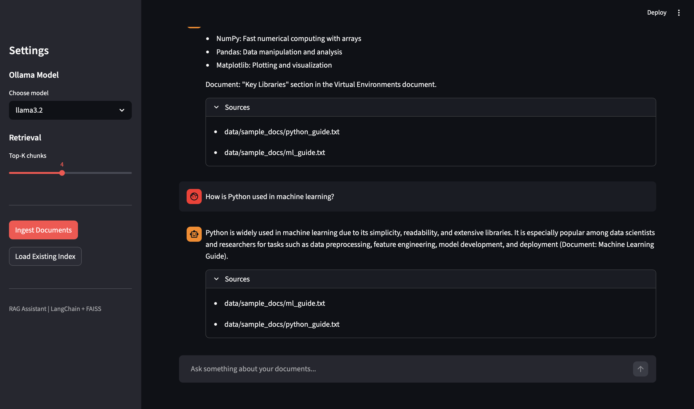

# RAG Knowledge Assistant

A full end-to-end Retrieval-Augmented Generation (RAG) pipeline built with LangChain.
Ask questions over your own documents with source attribution.

## Tech Stack

| Component    | Tool                                |
|--------------|-------------------------------------|
| Framework    | LangChain                           |
| Vector Store | FAISS or ChromaDB (switchable)      |
| Embeddings   | HuggingFace all-MiniLM-L6-v2 (free) |
| LLM          | Ollama llama3.2 (free, local)       |
| UI           | Streamlit                           |

## Default Stack - 100% Free, No API Key Needed

- Embeddings run locally via HuggingFace sentence-transformers
- LLM runs locally via Ollama
- Vector store switchable between FAISS and ChromaDB via .env
- No OpenAI or paid API required

Want better quality answers? You can optionally switch to OpenAI.
See the "Using OpenAI Instead" section below.

## Features

- Upload PDF or TXT files directly from the browser
- Automatic document chunking and indexing
- Semantic search over your documents
- Grounded answers with source attribution
- Switchable vector store: FAISS or ChromaDB
- Switchable LLM: Ollama (free) or OpenAI (paid)

## Setup

**1. Clone the repo**
```bash
git clone https://github.com/richakumari0311/rag-knowledge-assistant.git
cd rag-knowledge-assistant
```

**2. Create virtual environment**
```bash
python3 -m venv venv
source venv/bin/activate
pip install -r requirements.txt
```

**3. Configure**
```bash
cp .env.example .env
```

**4. Install and start Ollama**
```bash
brew install ollama
ollama serve
ollama pull llama3.2
```

**5. Run**
```bash
streamlit run app.py
```

Open http://localhost:8501 in your browser.

**6. Upload your documents**

Use the "Upload a new document" section in the UI to upload any PDF or TXT file.
Or place files directly in data/sample_docs/ and click "Ingest Documents".

## Project Structure

```
rag-knowledge-assistant/
├── app.py                  # Streamlit UI with file upload
├── src/
│   └── rag_pipeline.py     # Core RAG pipeline
├── data/
│   └── sample_docs/        # Sample documents included
├── requirements.txt
└── .env.example
```

## How It Works

```
Documents (PDF/TXT)
      |
      v
RecursiveCharacterTextSplitter (chunk_size=1000, overlap=200)
      |
      v
HuggingFace Embeddings (all-MiniLM-L6-v2)
      |
      v
Vector Store (FAISS or ChromaDB)
      |
      v
Retriever (Top-K similarity search)
      |
      v
LLM + Prompt Template (Ollama or OpenAI)
      |
      v
Grounded Answer + Source Attribution
```

## Switching Vector Store

In .env, set:
```
VECTOR_STORE=faiss    # default, fast, in-memory
VECTOR_STORE=chroma   # persistent, good for larger datasets
```

After switching, delete the old index and re-ingest:
```bash
rm -rf data/vectorstore
```

## Using OpenAI Instead (Optional)

**1. Install the OpenAI package**
```bash
pip install langchain-openai openai
```

**2. Update .env**
```
LLM_BACKEND=openai
OPENAI_API_KEY=sk-xxxxxxxxxxxxxxxxxxxxxxxx

EMBEDDING_BACKEND=openai
```

**3. Re-ingest your documents**
```bash
rm -rf data/vectorstore
streamlit run app.py
```

Note: OpenAI charges per API call. For most personal projects the cost
is very small, but keep that in mind.

## All Config Options

| Variable          | Options                   | Default       |
|-------------------|---------------------------|---------------|
| LLM_BACKEND       | ollama / openai           | ollama        |
| OLLAMA_MODEL      | llama3.2, mistral, phi3   | llama3.2      |
| EMBEDDING_BACKEND | huggingface / openai      | huggingface   |
| VECTOR_STORE      | faiss / chroma            | faiss         |
| CHUNK_SIZE        | any number                | 1000          |
| CHUNK_OVERLAP     | any number                | 200           |
| TOP_K_RESULTS     | any number                | 4             |

## Screenshots


